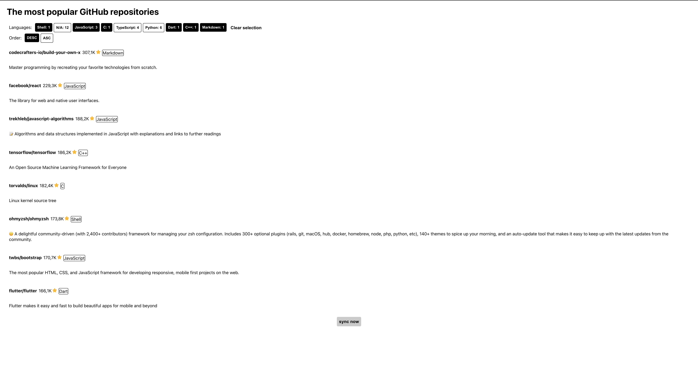

# React app for more easier interactions with API


In this directory you can install all modules using:
```sh
npm install
```

> [!CAUTION]
> Before running React app run API server first

And then you can easily run this React app on port `3001`:

<details>
  <summary>for <code>UNIX</code> systems</summary>

```sh
npm run start:unix
```

</details>
<details>
  <summary>for <code>windows</code></summary>

```sh
npm run start:windows
```

</details>

> [!TIP]
> You can easily change running port in `package.json` file at 18 and 19 lines

After running the app you can check the app on [`127.0.0.1:3001`](http://127.0.0.1:3001)
